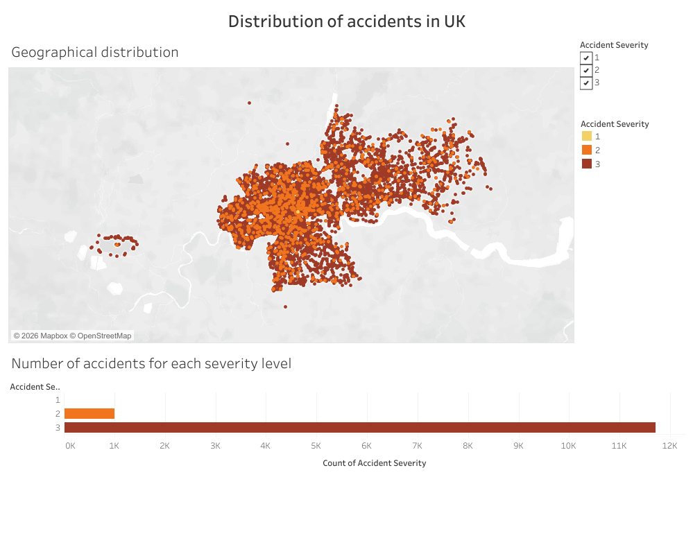

# UK Accidents Analysis Report

## Deliverables
This is a comprehensive report of the analysis done on the UK accidents in 2015. It entails the query 
results, visualizations and insights genearated from the dataset.

## Query results and Visualizations
The dataset provided had a total of 12713 reported cases grouped as either level 1, 2 or 3 according to accident severity. Level 3 cases accounted for over 92% of the data with 11746 occurences and the rest of the incidents being level 2 with 966 records. Level 1 had the lowest number with only one record overall.

