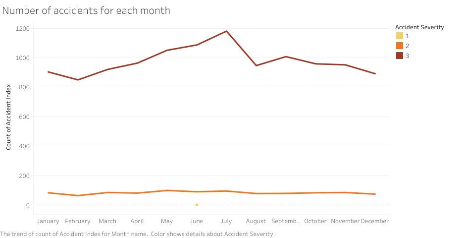
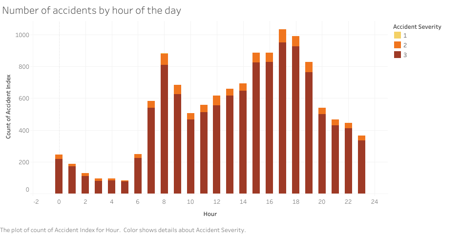
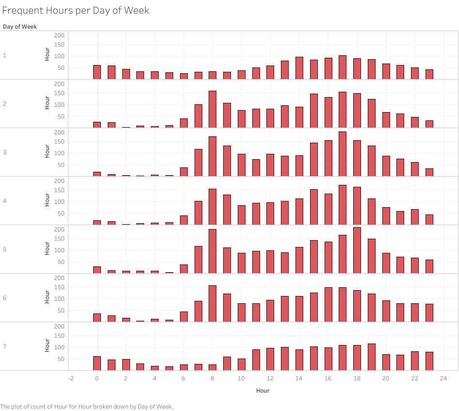
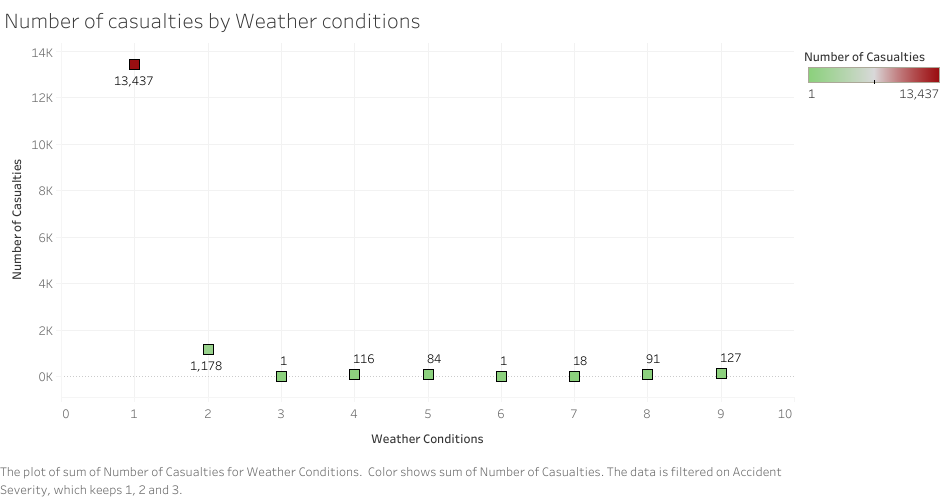
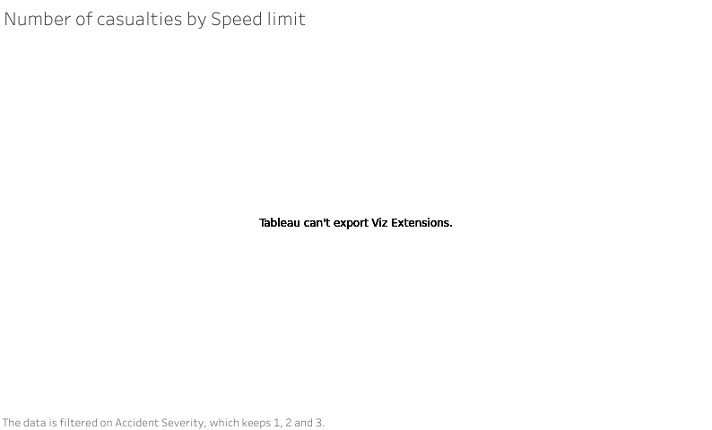

# UK Accidents Analysis Report

## Deliverables
This is a comprehensive report of the analysis done on the UK accidents in 2015. It entails the query 
results, visualizations and insights genearated from the dataset.

## Query results and Visualizations
### Distribution of accidents
The dataset provided had a total of 12713 reported cases grouped as either level 1, 2 or 3 according to accident severity. Level 3 cases accounted for over 92% of the data with 11746 occurences and the rest of the incidents being level 2 with 966 records. Level 1 had the lowest number with only one record overall.

### Trend of accidents over time
When we focus on the number of accidents for each month, we are able to spot the periods prone to have the highest number of cases. July recorded the highest with 1181 cases, with the numbers peaking from April to August between which the cases rose above the rest of the other months while the first and last three months had relatively lower numbers.

Generally, there is are observable differences in the number of cases for each hour of the day for the whole year. From the graph below, the numbers are significantly high from 0700hrs to 2000hrs.

Another interesting trend how the numbers vary for each one of them according to the type of day. There is a distinct difference between the weekdays(labeled as 2-6) and weekends(labeled as 1 and 7). On average, the numbers rise from 0700hrs and significantly top at 0800hrs on weekdays. The same goes for evening hours from 1500 to 1900hrs where the charts rise above average levels.
The weekends present different figures with most instances happening from 1300hrs to 2000hrs.

### Key factors 
The number of casualties is greatly influenced by different factors in the dataset. Weather conditions were grouped from 1 to 10, with 1 being the worst and 10 rating as good. The data showed that conditions grouped as 1 led to the largest number of casualties overall.

Another factor is the speed limit whose influence can be greatly associated with the road surface conditions. The speed limits range from 10 to 70km/h and road surface conditions coded from 1 to 4. Correlating these two, it shows that areas with speed limit of 30 and road surface conditions marked as 1 had the highest casualties of 11668.
*This is an interactive viz. To view the results and label marks, find the tableau visualization *

